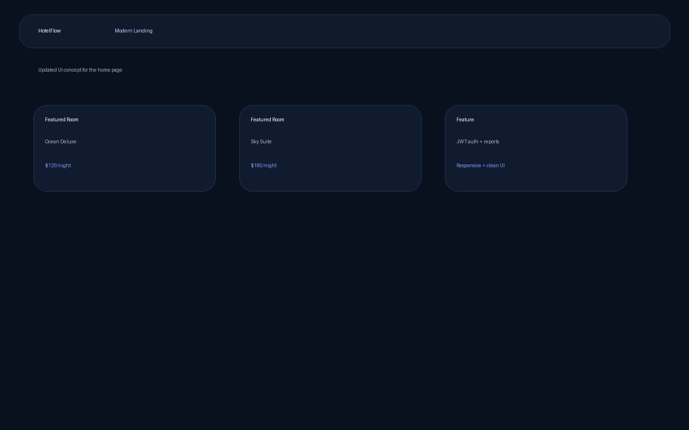
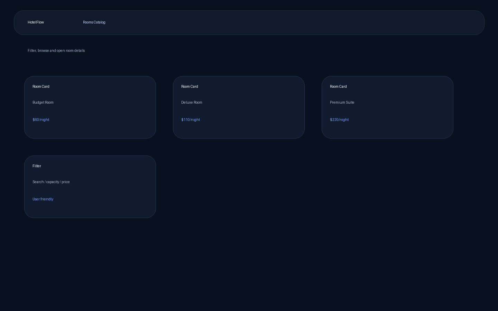
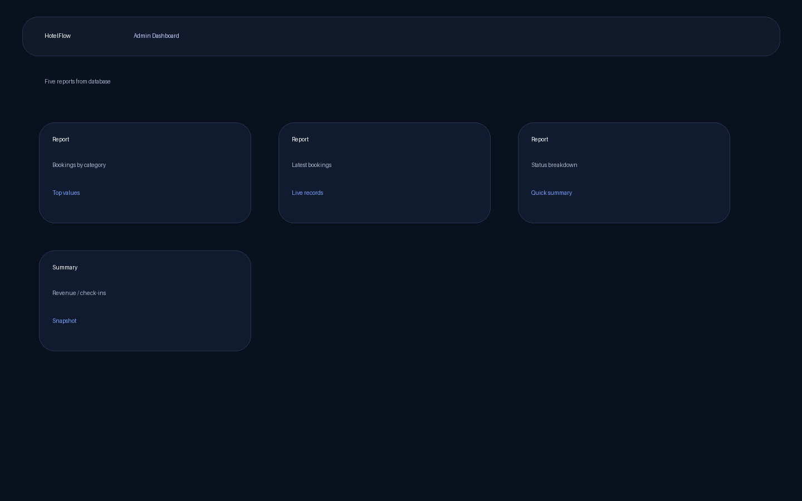

# HotelFlow

## Что это вообще такое
HotelFlow — это обновлённая full-stack система бронирования отеля на Django + React. Я взял старый проект, вычистил древности, обновил стек, переделал структуру, освежил UI и сделал так, чтобы это выглядело уже не как привет из прошлого, а как нормальный современный курсовой проект.

## Что умеет проект
1. Регистрация пользователя
2. Логин через JWT
3. Просмотр списка комнат
4. Просмотр детальной страницы комнаты
5. Фильтрация комнат по цене, названию и вместимости
6. Создание бронирования
7. Проверка корректности дат и вместимости
8. Админ-дэшборд для отчётов
9. Check-in и checkout логика
10. DAO-классы для CRUD-операций
11. Unit tests для model methods
12. Responsive интерфейс
13. Сообщения об ошибках при неправильном вводе
14. UML class diagram
15. Weekly meeting documentation

## Стек
- Backend: Django 5.2, Django REST Framework, SimpleJWT
- Frontend: React 19, Vite, React Router
- Database: SQLite
- Images: Pillow

## MVC
### Model
Модели лежат в `hotel_app/models.py`.

### View
Интерфейс лежит в `src/`.

### Controller
Контроллерная логика находится во views и API endpoints.

## DAO classes
- `CategoryDAO`
- `RoomDAO`
- `BookingDAO`

Файл: `hotel_app/services/dao.py`

## Таблицы базы данных
- Category
- Room
- Booking
- CheckIn
- Amenity
- RoomImage

## 5 отчётов из базы данных
- Bookings by category
- Top rooms by bookings
- Room performance
- Latest bookings
- Status breakdown

Endpoint: `GET /api/dashboard/reports/`

## Team Members List
- Ray Tama
- Member 2
- Member 3

## Roles of Group Members
- Ray Tama — backend refactor, frontend redesign, documentation, integration
- Member 2 — database filling, testing, screenshots, demo preparation
- Member 3 — presentation, UML polishing, QA section preparation

## Contributors
- Ray Tama
- Member 2
- Member 3

## Screenshots
### Home


### Rooms


### Dashboard


## UML Class Diagram
[docs/UML.md](docs/UML.md)

## Weekly Meeting Documentation
[docs/weekly-meetings.md](docs/weekly-meetings.md)

## Reports Documentation
[docs/reports.md](docs/reports.md)

## Presentation Materials
[docs/presentation-outline.md](docs/presentation-outline.md)

## Структура проекта
```text
hotel_app/
accounts/
hotel_reservation_site/
src/
docs/
```

## Как запускать
### Backend
```bash
python -m venv .venv
source .venv/bin/activate
pip install -r requirements.txt
cp .env.example .env
python manage.py makemigrations
python manage.py migrate
python manage.py createsuperuser
python manage.py runserver
```

### Frontend
```bash
npm install
npm run dev
```

### Адреса
- Backend API: `http://127.0.0.1:8000/api/`
- Frontend: `http://127.0.0.1:5173/`
- Admin panel: `http://127.0.0.1:8000/admin/`

## Важный момент про GitHub
Из проекта убраны старые git-следы, чтобы ты залил это в новый чистый репозиторий. Commit history нужно будет уже сделать после загрузки проекта на GitHub, потому что честно запихнуть новый history внутрь zip нельзя.

## Media links
- UML: [docs/UML.md](docs/UML.md)
- Weekly meetings: [docs/weekly-meetings.md](docs/weekly-meetings.md)
- Reports: [docs/reports.md](docs/reports.md)
- Presentation outline: [docs/presentation-outline.md](docs/presentation-outline.md)
- Screenshots: `docs/screenshots/`
