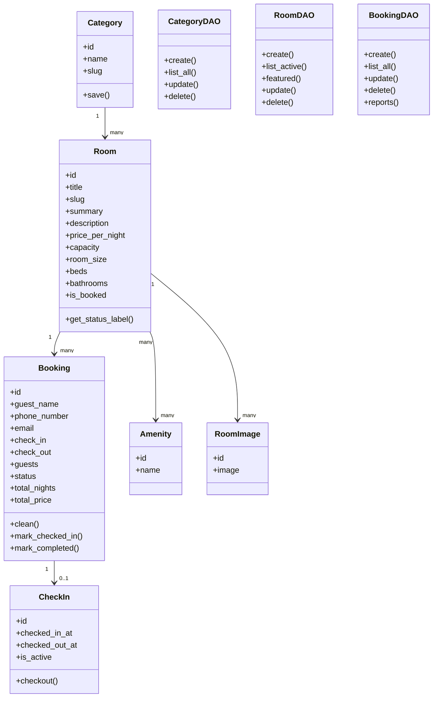

# UML Class Diagram

```mermaid
classDiagram
    class Category {
        +id
        +name
        +slug
        +save()
    }
    class Room {
        +id
        +title
        +slug
        +summary
        +description
        +price_per_night
        +capacity
        +room_size
        +beds
        +bathrooms
        +is_booked
        +get_status_label()
    }
    class Booking {
        +id
        +guest_name
        +phone_number
        +email
        +check_in
        +check_out
        +guests
        +status
        +total_nights
        +total_price
        +clean()
        +mark_checked_in()
        +mark_completed()
    }
    class CheckIn {
        +id
        +checked_in_at
        +checked_out_at
        +is_active
        +checkout()
    }
    class Amenity {
        +id
        +name
    }
    class RoomImage {
        +id
        +image
    }
    class CategoryDAO {
        +create()
        +list_all()
        +update()
        +delete()
    }
    class RoomDAO {
        +create()
        +list_active()
        +featured()
        +update()
        +delete()
    }
    class BookingDAO {
        +create()
        +list_all()
        +update()
        +delete()
        +reports()
    }
    Category "1" --> "many" Room
    Room "1" --> "many" Booking
    Room "1" --> "many" RoomImage
    Room "many" --> "many" Amenity
    Booking "1" --> "0..1" CheckIn
```
